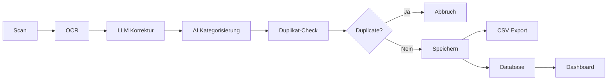

# 🤖 AI Document Organizer

[](https://www.python.org/)
[](LICENSE)
[](https://www.raspberrypi.com/)

> **KI-gestütztes Dokumentenverwaltungssystem** mit automatischer Kategorisierung, OCR, Duplikat-Erkennung, erweiterten Statistiken und LLM-Integration.


---

## ✨ Highlights

🧠 **AI-Powered** - Sentence Transformers & Qwen2.5-7B LLM  
📄 **OCR** - Tesseract mit automatischer Korrektur  
🔍 **Smart Search** - BM25 Full-Text + erweiterte Filter  
📊 **Analytics** - Statistiken, Trends, Budget-Tracking  
🔐 **Secure** - User Authentication mit Flask-Login  
🚀 **Production-Ready** - Systemd Service, Monitoring, Tests

---

## 🌟 Features

### 🤖 **AI & Machine Learning**
- **Automatische Kategorisierung** mit Sentence Transformers (`paraphrase-multilingual-MiniLM-L12-v2`)
- **OCR-Korrektur** via Qwen2.5-7B LLM (Ollama)
- **Intelligente Validierung** von Rechnungsdaten (Datum, Betrag, Währung)
- **Duplikat-Erkennung** (SHA256 Content Hashing)

### 📁 **Dokumentenverwaltung**
- Scanner-Integration (SANE-kompatibel)
- Hierarchische Ordnerstruktur: `Jahr/Kategorie/Subkategorie`
- Metadaten in SQLite + strukturierte CSV-Exports
- Tag-System für flexible Organisation
- Gespeicherte Suchfilter

### 🔍 **Suche & Filter**
- BM25 Volltext-Suche
- Erweiterte Filter (Datum, Betrag, Tags, Kategorie)
- Saved Searches für wiederkehrende Abfragen

### 📊 **Statistiken & Analytics**
- Monatliche Ausgaben-Trends
- Budget-Tracking pro Kategorie (mit Warnsystem)
- Ausgaben-Prognosen (Linear Regression)
- Jahresvergleiche
- Interaktive Charts (Chart.js)

### 🔐 **Sicherheit**
- User Authentication (Flask-Login)
- Password Hashing (Werkzeug)
- Session Management
- Login/Logout Flow

### 💬 **Chatbot-Assistent**
- Ollama-Integration (Qwen2.5-7B)
- Kontext-bewusste Antworten
- Dokumenten-Suche via natürliche Sprache

---

## 📋 Voraussetzungen

### Hardware
- **Raspberry Pi 5** (8GB RAM empfohlen)
- **2TB SSD** (USB 3.0)
- **Scanner** (SANE-kompatibel, z.B. HP)

### Software
- **OS:** Raspberry Pi OS (64-bit) / Ubuntu Server
- **Python:** 3.10+
- **Ollama:** (optional, für LLM-Features)

---

## 🚀 Quick Start

### 1️⃣ Installation

```bash
# Repository klonen
git clone https://github.com/moinmoin-64/Autodocumentsorganizer.git
cd Autodocumentsorganizer

# Installations-Script ausführen
chmod +x install.sh
sudo ./install.sh
```

**Das Script installiert:**
- ✅ Python Dependencies (virtualenv)
- ✅ Tesseract OCR (DE + EN)
- ✅ SANE Scanner-Treiber
- ✅ Ollama + Qwen2.5-7B Model
- ✅ Systemd Service

### 2️⃣ Konfiguration

```bash
nano config.yaml
```

**Wichtige Einstellungen:**
```yaml
web:
  port: 5000
  host: "0.0.0.0"

auth:
  enabled: true
  default_username: "admin"
  default_password: "admin"  # ÄNDERN!

scanner:
  device: "hpaio:/usb/..."  # Gerät mit 'scanimage -L' finden

storage:
  base_path: "/mnt/documents"

ollama:
  enabled: true
  model: "qwen2.5:7b"
```

### 3️⃣ SSD mounten

```bash
# SSD formatieren (falls nötig)
sudo mkfs.ext4 /dev/sda1

# Mount-Point erstellen
sudo mkdir -p /mnt/documents

# Mounten
sudo mount /dev/sda1 /mnt/documents
sudo chown -R pi:pi /mnt/documents

# Auto-Mount in /etc/fstab
echo "UUID=$(blkid -s UUID -o value /dev/sda1) /mnt/documents ext4 defaults 0 2" | sudo tee -a /etc/fstab
```

### 4️⃣ Service starten

```bash
sudo systemctl start document-manager
sudo systemctl enable document-manager  # Auto-start
sudo systemctl status document-manager
```

### 5️⃣ Dashboard öffnen

Browser: **`http://<raspberry-pi-ip>:5000`**

**Default Login:**
- Username: `admin`
- Password: `admin` ⚠️ **Bitte sofort ändern!**

---

## 📁 Projektstruktur

```
Autodocumentsorganizer/
├── app/
│   ├── __init__.py
│   ├── server.py                # Flask Server + API
│   ├── auth.py                  # Authentication
│   ├── database.py              # SQLite ORM
│   ├── scanner_handler.py       # Scanner-Integration
│   ├── document_processor.py    # OCR + LLM Processing
│   ├── categorizer.py           # AI Kategorisierung
│   ├── storage_manager.py       # Dateiverwaltung
│   ├── data_extractor.py        # Datenextraktion
│   ├── search_engine.py         # BM25 Suche
│   ├── statistics_engine.py     # Statistiken + Prognosen
│   ├── ollama_client.py         # LLM Client
│   ├── upload_handler.py        # File Upload + Duplikat-Check
│   ├── queue_manager.py         # Processing Queue
│   └── static/
│       ├── index.html           # Dashboard
│       ├── login.html           # Login Page
│       ├── css/
│       │   ├── style.css
│       │   ├── tabs.css
│       │   └── advanced-search.css
│       └── js/
│           ├── app.js           # Dashboard Logic
│           ├── chatbot.js       # Chatbot UI
│           ├── statistics.js    # Charts
│           └── advanced-search.js
├── tests/
│   ├── test_categorizer.py
│   ├── test_document_processor.py
│   └── test_e2e.py              # End-to-End Tests
├── systemd/
│   └── document-manager.service # Systemd Service
├── main.py                      # Entry Point
├── config.yaml                  # Konfiguration
├── requirements.txt             # Python Dependencies
├── install.sh                   # Setup Script
├── backup.py                    # Backup Utility
├── monitor.py                   # System Monitor
└── README.md
```

---

## � API Endpoints

### 📄 Dokumente
```http
GET    /api/documents              # Liste aller Dokumente
GET    /api/documents/<id>         # Einzelnes Dokument
GET    /api/documents/search       # Suche (BM25)
POST   /api/documents/advanced     # Erweiterte Suche
GET    /api/documents/<id>/download
POST   /api/upload                 # File Upload
POST   /api/upload/process/<path>  # Verarbeitung starten
```

### 🏷️ Tags
```http
GET    /api/tags                   # Alle Tags
POST   /api/tags                   # Tag erstellen
DELETE /api/tags/<id>              # Tag löschen
```

### 📊 Statistiken
```http
GET    /api/statistics/overview    # Übersicht
GET    /api/statistics/trends/<year>
GET    /api/statistics/budgets
POST   /api/statistics/budgets     # Budget setzen
GET    /api/statistics/budgets/<category>/<month>
GET    /api/statistics/predictions/<category>
```

### 💬 Chatbot
```http
POST   /api/chat                   # Message senden
```

### 🔐 Authentication
```http
POST   /api/auth/login
POST   /api/auth/logout
GET    /api/auth/status
```

Vollständige API-Dokumentation: **[API.md](API.md)**

---

## 🧪 Testing

```bash
# Alle Tests
pytest

# Kategorisierung testen
pytest tests/test_categorizer.py -v

# End-to-End Tests
pytest tests/test_e2e.py -v

# Mit Coverage
pytest --cov=app tests/
```

---

## �️ Entwicklung

### Manuell starten (ohne Systemd)

```bash
cd Autodocumentsorganizer
source venv/bin/activate
python main.py
```

### Logs

```bash
# Systemd Logs
journalctl -u document-manager -f

# App Logs
tail -f /var/log/document-manager/app.log
```

### Scanner testen

```bash
scanimage -L                    # Geräte auflisten
scanimage --format=jpeg > test.jpg
```

### Ollama testen

```bash
ollama list                     # Installierte Models
ollama run qwen2.5:7b "Hallo"  # Test
```

---

## � Datenstruktur

```
/mnt/documents/
├── storage/                     # Dokumente
│   ├── 2024/
│   │   ├── Rechnung/
│   │   │   ├── Strom/
│   │   │   │   └── 2024-03-15_rechnung_strom.pdf
│   │   │   └── Internet/
│   │   ├── Versicherung/
│   │   │   ├── Haftpflicht/
│   │   │   └── KFZ/
│   │   ├── Vertrag/
│   │   └── ...
│   └── 2025/
├── data/                        # CSV Exports
│   ├── 2024/
│   │   ├── rechnung_data.csv
│   │   └── versicherung_data.csv
│   └── 2025/
├── database.db                  # SQLite Database
└── structure.json               # Ordnerstruktur-Cache
```

---

## � Fehlerbehebung

### Scanner funktioniert nicht

```bash
# SANE Status
sudo systemctl status saned

# HP Setup (für HP-Geräte)
hp-setup

# Berechtigungen
groups pi  # Sollte "scanner" enthalten
sudo usermod -a -G scanner pi
```

### Ollama Probleme

```bash
# Service
sudo systemctl status ollama

# Model neu laden
ollama pull qwen2.5:7b

# RAM-Probleme? Kleineres Model:
ollama pull qwen2.5:1.5b
```

### Niedriger RAM (< 8GB)

```yaml
# In config.yaml - LLM Features deaktivieren
ollama:
  enabled: false
```

### Import-Fehler

```bash
# CUDA-Fehler (SentenceTransformer)
# Wird automatisch zu CPU fallback

# Manuelle CPU-Erzwingung:
export CUDA_VISIBLE_DEVICES=""
```

---

## 🔐 Sicherheit

⚠️ **Standard-Passwort ändern!**
```yaml
# config.yaml
auth:
  default_password: "DEIN_SICHERES_PASSWORT"
```

🔒 **Best Practices:**
- Nur im lokalen Netzwerk betreiben
- Firewall: Port 5000 nur für LAN freigeben
- Regelmäßige Backups der SSD
- HTTPS für Produktiv-Umgebungen (mit Reverse Proxy)

---

## 📦 Backup

```bash
# Automatisches Backup
python backup.py

# Backup-Cron einrichten
chmod +x setup_backup_cron.sh
./setup_backup_cron.sh
```

---

## 🚀 Workflow



1. **Dokument scannen** → Scanner-Integration
2. **OCR** → Tesseract Texterkennung
3. **LLM-Korrektur** → Qwen2.5 verbessert OCR (bei Confidence < 80%)
4. **Validierung** → LLM extrahiert strukturierte Daten
5. **Kategorisierung** → AI ordnet automatisch ein
6. **Duplikat-Check** → SHA256 Hash-Vergleich
7. **Speichern** → Ordner + Database + CSV
8. **Dashboard** → Statistiken, Suche, Analytics

---

## 📝 Lizenz

MIT License - siehe [LICENSE](LICENSE)

---

## 🤝 Contributing

Pull Requests willkommen! Für größere Änderungen bitte zuerst ein Issue erstellen.

---

## 💡 Support

- 🐛 **Bugs:** [GitHub Issues](https://github.com/moinmoin-64/Autodocumentsorganizer/issues)
- 💬 **Fragen:** [GitHub Discussions](https://github.com/moinmoin-64/Autodocumentsorganizer/discussions)
- 📧 **Email:** [Kontakt](mailto:your-email@example.com)

---

## 🙏 Credits

**Genutzte Technologien:**
- [Flask](https://flask.palletsprojects.com/) - Web Framework
- [Tesseract OCR](https://github.com/tesseract-ocr/tesseract) - OCR Engine
- [Sentence Transformers](https://www.sbert.net/) - Semantic Search
- [Ollama](https://ollama.ai/) - LLM Runtime
- [Chart.js](https://www.chartjs.org/) - Visualisierungen
- [SANE](http://www.sane-project.org/) - Scanner Interface

---

<div align="center">

**Made with ❤️ for Raspberry Pi**

[](https://github.com/moinmoin-64/Autodocumentsorganizer)

</div>
